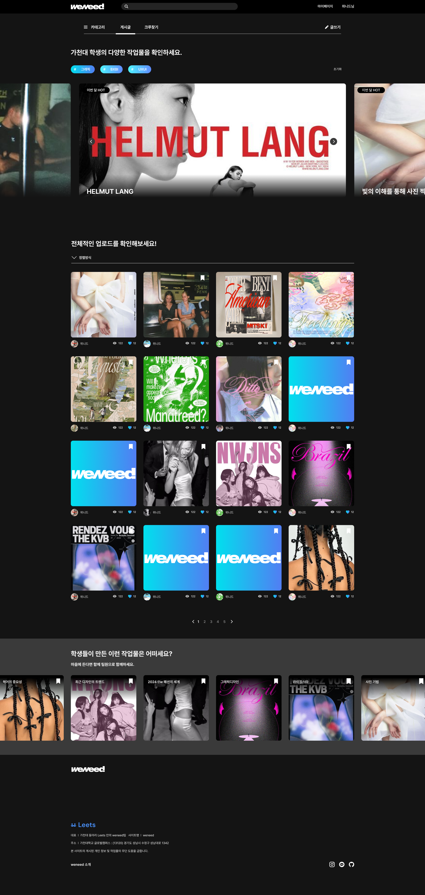
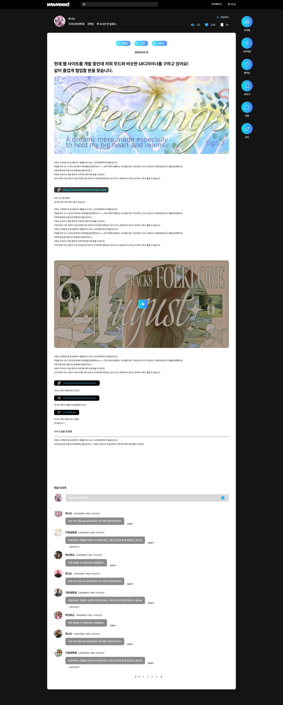

  <h1></h1> 

> 서비스는 아쉽게도 종료되었습니다. 🥹

 

    

 

## ✍🏻 프로젝트 개요

나의 커리어 일기장 위닛
We Need, Win It 🎯
 

위닛은 자신의 작업물을 손쉽게 홍보하고, 동시에 동료를 구할 수 있는 서비스입니다!
각자의 고유한 색채가 담긴 프로젝트, 작품, 디자인을 손쉽게 홍보하고 구경하세요. 🙌
 

특정 작업물이 마음에 드셨나요?
그렇다면 이제 함께하고 싶은 이들에게 위닛을 통해 연락해보세요!
위닛과 함께라면, 지향하는 가치관과 부합하는 동료들을 찾는 것은 어렵지 않답니다 🤗
 
 

필요한 이들이 모여 승리를 쟁취하는 곳
여러분의 성장기록 위닛과 함께해주세요!

 

## ⚙️ 기술 스택

<table>
    <thead>
        <tr>
            <th>분류</th>
            <th>기술 스택</th>
        </tr>
    </thead>
    <tbody>
        <tr>
            <td>
                  
프론트엔드

            </td>
            <td>
                  
                  
                  
                  
            </td>
        </tr>
        <tr>
            <td>
                
백엔드

            </td>
            <td>
                
              
              
            </td>
        </tr>
        <tr>
            <td>
                
협업

            </td>
            <td>
                
                
            </td>
        </tr>
    </tbody>

</table>

 

## 🧡 FE 팀원 소개

|                                                             김나영                                                              |                                     최민규                                     |                                    조혜원                                     |
| :-----------------------------------------------------------------------------------------------------------------------------: | :----------------------------------------------------------------------------: | :---------------------------------------------------------------------------: |
|  |  |  |
|                                                             **FE**                                                              |                                     **FE**                                     |                                    **FE**                                     |
|                                         [@nayoung3669](https://github.com/nayoung3669)                                          |                  [@Minkyu0424](https://github.com/Minkyu0424)                  |                 [@One-HyeWon](https://github.com/One-HyeWon)                  |

 

## 🖥️ 화면 구성

### 메인 / 상세 조회

 

### 게시물 작성 (포트폴리오, 크루찾기) / 지원서 / 모집서 작성

      

 

 

## 🚀 핵심 기능 및 FE 기술적 도전

### 1) Route Handlers 적용

- Node.js 서버를 통한 Mock API 구현 및 토큰 관리

### 2) Amazon S3 이미지 변환

- 프론트엔드단에서 File → URL(string타입) 이미지 변환

### 3) Atomic 디자인 패턴 지향

- 도메인 중심의 Page, Layout, Containers, Component 단위로 구성해 로직과 UI 분리
- common 폴더로 팀원 공통 코드, constants 폴더로 상수 관리

### 4) 게시물 CRUD

- postRequest, getRequest라는 공통 함수를 정의해 로직의 일관성 유지
- intersectionObserver 활용 무한스크롤 구현
- optimistic UI 적용 (좋아요, 북마크)
- 파일 다운로드 기능

### 5) 최적화

- image에 placeholder적용, avif 렌더링, lazyLoading
- 모달 dynamic import 활용으로 페이지 bundle size 축소
- throttling 적용
